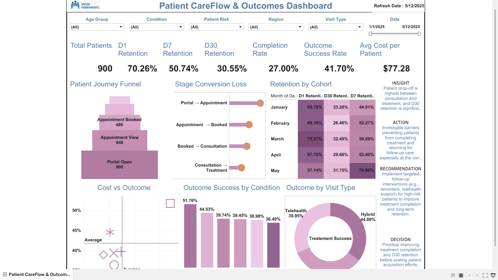
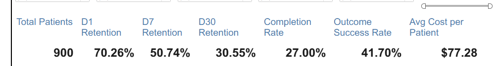
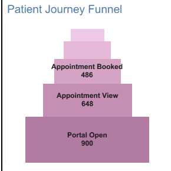
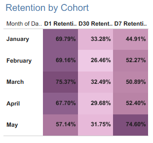

# Patient CareFlow & Outcomes Dashboard



# Executive Summary

This project analyzes patient journey progression, retention performance, treatment completion, outcome success, and care-cost exposure to help healthcare operations teams improve patient engagement and care outcomes.

Using Tableau, SQL, Python, and Streamlit, the analysis evaluates patient funnel progression, D1, D7, and D30 retention, completion rates, outcome success rates, visit type performance, condition-level outcomes, and treatment costs to identify where patients disengage and where operational improvements should be prioritized.

The dashboard supports healthcare decision-making by helping stakeholders:

* Identify patient drop-off across the care journey
* Monitor retention and treatment completion performance
* Evaluate outcome success across conditions and visit types
* Prioritize follow-up interventions for at-risk patients
* Improve operational efficiency and patient outcomes

Expected business value includes:

* Improved treatment completion
* Increased long-term retention
* Reduced avoidable patient drop-off
* Improved outcome success rates
* Better prioritization of operational resources

Built using Tableau, SQL, Python, and Streamlit for healthcare analytics, KPI reporting, and decision-support analytics.

---

# Business Problem

Healthcare organizations need visibility into how patients progress through the care journey and where disengagement occurs.

Without effective monitoring, healthcare teams may struggle to:

* Identify patient drop-off points
* Improve treatment completion rates
* Monitor retention performance
* Evaluate outcome success across patient groups
* Prioritize follow-up interventions
* Optimize care delivery resources

This project helps healthcare leaders understand patient engagement patterns and identify opportunities to improve care continuity and treatment outcomes.

---

# Decision Support Use Case

This dashboard helps healthcare operations teams, care coordinators, clinical leaders, and decision-support analysts monitor patient progression across the care journey, identify treatment bottlenecks, evaluate operational performance, and support decisions aimed at improving patient flow, care coordination, retention, and treatment outcomes.

---

# KPIs

| KPI                  |  Value | Business Purpose                      |
| -------------------- | -----: | ------------------------------------- |
| Total Patients       |    900 | Measures patient population analyzed  |
| D1 Retention         | 63.33% | Measures immediate patient engagement |
| D7 Retention         | 40.11% | Measures short-term care continuity   |
| D30 Retention        | 23.44% | Measures long-term patient retention  |
| Completion Rate      | 27.00% | Measures treatment journey completion |
| Outcome Success Rate | 25.11% | Measures successful patient outcomes  |
| Avg Cost per Patient | $77.28 | Measures care-cost exposure           |

---

# Dashboard Overview

The dashboard provides a comprehensive view of patient progression, treatment completion, retention performance, outcome success, and care-cost exposure.

Core reporting areas include:

* Patient Journey Funnel Analysis
* D1, D7, and D30 Retention Monitoring
* Treatment Completion Tracking
* Outcome Success Analysis
* Condition Performance Evaluation
* Visit Type Performance Analysis
* Cost Exposure Monitoring

The dashboard supports healthcare operations teams by providing visibility into patient engagement and treatment outcomes.

---

# Dashboard Screenshots

## Main Dashboard


## KPI Overview



## Journey Funnel



## Retention Cohort



---

# Key Insight

The largest patient drop-off occurs after the initial consultation phase, with D30 retention declining to 23.44%, indicating that long-term care continuity represents the greatest opportunity for operational improvement and patient engagement intervention.

---

# Business Impact

This dashboard can help healthcare organizations:

* Improve treatment completion by an estimated 5–8%
* Increase D30 retention by 3–6 percentage points
* Reduce avoidable patient drop-off by 10–15%
* Improve telehealth utilization efficiency
* Enable earlier intervention for high-risk patient cohorts
* Support KPI-driven healthcare decision-making

---

# Recommendation

Implement targeted follow-up programs, telehealth engagement strategies, and care-navigation interventions focused on patients at risk of disengagement in order to improve treatment completion, long-term retention, and overall outcome success.

---

# Data Dictionary

| Field           | Description                         |
| --------------- | ----------------------------------- |
| patient_id      | Unique patient identifier           |
| funnel_stage    | Patient journey stage               |
| journey_date    | Patient event date                  |
| condition       | Clinical condition category         |
| visit_type      | In-person, virtual, or hybrid visit |
| region          | Geographic region                   |
| d1_retained     | Day 1 retention indicator           |
| d7_retained     | Day 7 retention indicator           |
| d30_retained    | Day 30 retention indicator          |
| outcome_success | Successful treatment outcome flag   |
| treatment_cost  | Cost associated with treatment      |

---

# EDA + Feature Engineering

The project includes exploratory data analysis, data validation, and feature engineering designed to improve patient journey analysis and retention monitoring.

### Key Activities

* Missing value validation
* Duplicate record checks
* Funnel-stage validation
* Patient journey sequencing
* Retention calculations
* Treatment completion analysis
* Cost analysis
* Outcome monitoring

### Engineered Features

* funnel_stage_order
* completion_flag
* retention_band
* cost_band
* outcome_success_flag
* patient_risk_category

These engineered features support patient journey monitoring, retention analysis, and operational decision-making.

---

# SQL Queries

The repository includes representative SQL queries supporting:

* KPI Summary
* Funnel Drop-Off Analysis
* Retention Analysis
* Outcome Success Analysis

### Patient Retention KPI

```sql
SELECT
    ROUND(AVG(d30_retained) * 100, 2) AS d30_retention_rate
FROM careflow_clean;
```

### Funnel Drop-Off Analysis

```sql
SELECT
    funnel_stage,
    COUNT(patient_id) AS patients
FROM careflow_clean
GROUP BY funnel_stage
ORDER BY patients DESC;
```

---

# Metrics Engineering

```text
D1 Retention Rate = D1 Retained Patients / Total Patients

D7 Retention Rate = D7 Retained Patients / Total Patients

D30 Retention Rate = D30 Retained Patients / Total Patients

Completion Rate = Completed Patients / Total Patients

Outcome Success Rate = Successful Outcomes / Total Patients

Average Cost per Patient = Total Treatment Cost / Total Patients

Stage Drop-Off = Previous Stage Patients - Current Stage Patients

Stage Conversion Rate = Current Stage Patients / Previous Stage Patients
```

This project emphasizes:

* Patient journey analytics
* Retention monitoring
* Treatment completion analysis
* Outcome measurement
* Cost exposure monitoring
* Healthcare operations reporting

---

# Analytics Workflow

```text
Business Problem
        ↓
EDA + Cleaning
        ↓
Feature Engineering
        ↓
SQL Transformations
        ↓
Metrics Engineering
        ↓
Dashboard Development
        ↓
Business Insights
        ↓
Decision Support
        ↓
Business Impact
```

---

# Executive Decision Summary

### Insight

Long-term patient retention declines significantly after the initial consultation phase, creating operational challenges for treatment completion and outcome success.

### Action

Monitor D30 retention, treatment completion, and high-risk patient cohorts while strengthening patient follow-up efforts.

### Recommendation

Expand telehealth support, automated reminders, and care-navigation interventions to improve long-term patient engagement.

### Decision

Prioritize treatment completion and D30 retention improvement before increasing patient acquisition efforts.

---

# Tools Used

* SQL
* Tableau
* Python
* Pandas
* Streamlit
* Excel
* GitHub

---

# Repository Structure

```text
Patient-CareFlow-Outcomes-Dashboard/
├── app/
├── dashboard/
├── data/
├── docs/
├── notebooks/
├── screenshots/
├── sql/
├── README.md
└── requirements.txt
```

---

# How to Run the Project

```bash
git clone https://github.com/Denis0242/Patient-Careflow

pip install -r requirements.txt

streamlit run app/streamlit_app.py
```

---

# Future Improvements

* Add predictive modeling for patients at risk of non-completion
* Add A/B testing for follow-up interventions
* Connect to Snowflake or Redshift
* Add automated refresh workflows
* Add cohort-based retention analysis

---

# Disclaimer

* Dataset is synthetic and created for portfolio purposes.
* No real patient information is included.
* Project developed for educational and demonstration purposes.
* Healthcare metrics and business impact estimates are illustrative and intended to demonstrate analytical decision-making.
